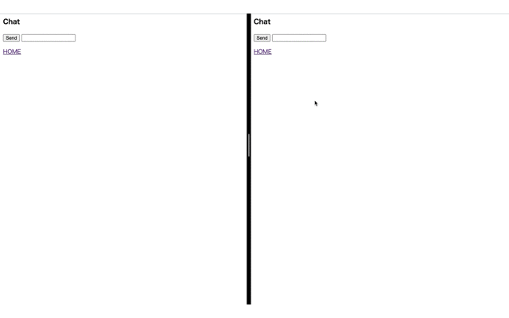

# webchat
This is Simple WebChat using WebSocket.  
This is implemented in accordance with clean architecture, so It's easy to extend function.(just I think so...)

# Requirement
I confirmed operation with the following version.  
- Docker version 20.10.5, build 55c4c88

# DEMO


# Try
1.
```/bin/sh
% git clone https://github.com/taise-hub/webchat.git
```
```
% cd webchat
```
```/bin/sh
% docker-compose build
```
```/bin/sh
% docker-compose up -d
```

2. 
access localhost:8080

# Author
[井上大誠](https://github.com/taise-hub)
